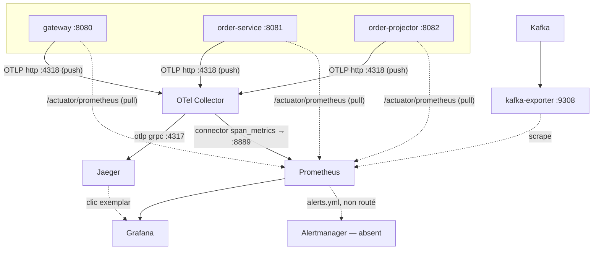

# Comprendre l'observabilité de ce POC, brique par brique

Ce document explique **ce qui a été mis en place et pourquoi**, en partant d'une requête concrète et en descendant
jusqu'à la configuration réelle. Il complète [observability.md](observability.md) (référence/runbook au quotidien) et
[ADR-0005](adr/0005-observabilite-opentelemetry.md) (décision et justification courte). Le schéma associé :
[Plomberie Observabilité](https://claude.ai/artifact/N29FBWd4JrfUq7P7oH7zcS).

- [1. Suivre une commande de bout en bout](#1-suivre-une-commande-de-bout-en-bout)
- [2. Trois flux, trois logiques de transport](#2-trois-flux-trois-logiques-de-transport)
- [3. Qui fait quoi, concrètement](#3-qui-fait-quoi-concrètement)
- [4. Le mécanisme des spans automatiques](#4-le-mécanisme-des-spans-automatiques)
- [5. La corrélation par baggage](#5-la-corrélation-par-baggage)
- [6. Le rôle de l'OTel Collector et des exemplars](#6-le-rôle-de-lotel-collector-et-des-exemplars)
- [7. Pourquoi l'OTLP est coupé pour les métriques et les logs, mais pas pour les traces](#7-pourquoi-lotlp-est-coupé-pour-les-métriques-et-les-logs-mais-pas-pour-les-traces)
- [8. Glossaire](#8-glossaire)

## 1. Suivre une commande de bout en bout

Un `POST /orders` produit **une seule trace**, qui traverse trois processus et un passage asynchrone par Kafka sans
jamais se rompre :

```
[gateway] http post /orders/**
  [order-service] http post /orders
    CreateOrderService.create                              ← span automatique (use case)
      SpringUnitOfWork.inTransaction                       ← frontière de transaction
        JdbcOrderRepository.save → query (INSERT orders)   ← span SQL
        OutboxOrderEventPublisher.publish → outbox schedule
          outbox process → orders.events send              ← publication asynchrone (~100 ms plus tard)
            [order-projector] orders.events process
              ProjectOrderService.project
                JdbcOrderViewStore.saveIfNewer → query (INSERT … ON CONFLICT)
```

Rien de tout ça n'est écrit à la main dans le code métier. Ce document explique comment chaque maillon existe.

## 2. Trois flux, trois logiques de transport

Le réflexe naturel serait de traiter « l'observabilité » comme un seul flux vers un seul endroit. Ce n'est pas ainsi
que c'est construit : traces, métriques et logs partent chacun avec une logique de transport différente, choisie pour
ce qu'elle apporte.

| Flux | Mécanisme | Direction | Pourquoi |
|---|---|---|---|
| **Traces** | push OTLP vers l'OTel Collector | l'application envoie | chaque requête est un événement discret ; on veut l'acheminer tout de suite pour assembler l'arbre multi-services |
| **Métriques** | pull, Prometheus scrape `/actuator/prometheus` | Prometheus vient lire | ce sont des états cumulatifs (compteurs, histogrammes) ; le pull permet en plus les **exemplars** (§6-7) |
| **Logs** | écriture stdout, JSON structuré (ECS) | un agent de plateforme viendrait lire (non implémenté ici) | pas de dépendance réseau supplémentaire, pattern standard « le conteneur écrit, la plateforme collecte » |

## 3. Qui fait quoi, concrètement

Voir le [schéma complet](https://claude.ai/artifact/N29FBWd4JrfUq7P7oH7zcS) pour la vue d'ensemble avec les ports et
protocoles. Résumé :



- **`observability-starter`** (dans chaque appli) : pont Micrometer ↔ OpenTelemetry, spans automatiques, filtrage du
  bruit. C'est la brique qui rend tout le reste possible sans instrumentation manuelle (détail : §4).
- **OTel Collector** : reçoit les traces en OTLP, les réexporte vers Jaeger, et dérive des métriques RED (rate,
  erreurs, durée) depuis les spans via le connector `span_metrics`.
- **Jaeger** : stockage et UI des traces (recherche par Trace ID ou par tag `order.id`).
- **Prometheus** : scrape les trois applis, l'OTel Collector (métriques RED) et kafka-exporter ; évalue les règles
  d'alerte ; stocke les exemplars.
- **kafka-exporter** : lit le lag des consumer groups directement côté broker Kafka — reste juste même si le
  consommateur est arrêté (contrairement à une métrique émise par le consommateur lui-même).
- **Grafana** : dashboards, avec les deux sources (Prometheus + Jaeger) reliées par les exemplars.
- **Agent de log plateforme** et **Alertmanager** : non implémentés dans ce POC (voir
  [production-checklist.md](production-checklist.md)).

## 4. Le mécanisme des spans automatiques

Aucune ligne de `@Traced` ou de code d'instrumentation dans le métier. `ObservabilityAutoConfiguration`
(`observability-starter`) enregistre un `Advisor` AspectJ dont le pointcut cible **toute méthode publique** des
packages `..application..` et `..infrastructure.adapter.out..` (propriété `poc.observability.traced-code`).
Concrètement :

- Un span est ouvert à l'entrée de chaque méthode de ces couches et fermé à la sortie, avec les attributs
  `code.namespace`, `code.function`, `code.layer`.
- Convention de nommage forte en contrepartie : renommer ces packages sans adapter le pointcut désactive
  silencieusement le traçage sur les classes déplacées.
- Le même starter filtre le bruit : pas de trace pour `/actuator` (sinon chaque scrape Prometheus en créerait une),
  pas de span SQL orphelin pour le polling de l'outbox ou les migrations Flyway, pas de trace par tick du
  scheduler Namastack (10 fois par seconde).

Les spans HTTP et Kafka, eux, viennent directement des observations Spring Boot
(`management.observations.*`, `spring.kafka.*.observation-enabled`) : le starter n'a rien à faire, Spring les émet
nativement dès que le pont OpenTelemetry est sur le classpath.

## 5. La corrélation par baggage

`order.id` est un **baggage W3C**, posé une seule fois par l'adapter web à l'entrée (classe `Correlation`), puis
propagé automatiquement :

- en HTTP, via l'en-tête `baggage` ;
- dans Kafka, via les en-têtes du message ;
- à travers l'outbox : Namastack sérialise le `traceparent` et le `baggage` dans la colonne `context` de
  `outbox_record`, et restaure le contexte au moment de la publication — c'est ce qui permet à la trace de survivre
  au passage asynchrone par la base.

Le starter recopie ensuite les champs de baggage déclarés (`management.tracing.baggage.tag-fields`) en attribut de
**chaque** span créé après leur pose (bean `baggageToSpanAttributes` — Spring Boot ne tague nativement que le span
courant au moment où le baggage est posé, pas les spans enfants créés ensuite).

Point de sécurité : **la gateway supprime l'en-tête `baggage` envoyé par les clients** avant de poser le sien. Sans
ça, n'importe quel client pourrait injecter un faux `order.id` et polluer la corrélation d'un tiers dans les traces
et les logs.

## 6. Le rôle de l'OTel Collector et des exemplars

L'OTel Collector n'est pas un simple relais : il fait deux choses utiles.

1. **Réexporter les traces vers Jaeger** (`otlp_grpc/jaeger`, port 4317) — le stockage et la recherche.
2. **Dériver des métriques depuis les traces** via le connector `span_metrics` : pour chaque span reçu, il calcule
   un histogramme de durée et compte les occurrences/erreurs, par service et par nom d'opération. Ces métriques
   « RED » (Rate/Errors/Duration) sont exposées sur `:8889` au format Prometheus et scrapées comme n'importe quelle
   autre cible.

C'est là qu'apparaît l'**exemplar** : un exemplar, c'est un identifiant de trace attaché à un point précis d'un
histogramme de métrique. Quand Grafana affiche `projection_lag_seconds` (p95) et qu'un pic apparaît, cliquer sur ce
point ouvre **directement** une trace représentative de ce pic dans Jaeger — sans avoir à chercher manuellement dans
quelle fenêtre de temps le problème s'est produit. C'est le mécanisme central du runbook décrit dans
[observability.md](observability.md#runbook).

## 7. Pourquoi l'OTLP est coupé pour les métriques et les logs, mais pas pour les traces

Ce n'est pas « l'OTLP a été désactivé » globalement — seulement pour deux des trois signaux. Concrètement, dans
[`observability-defaults.properties`](../observability-starter/src/main/resources/META-INF/poc/observability-defaults.properties) :

```properties
# Traces : reste actif, en push OTLP
management.opentelemetry.tracing.export.otlp.endpoint=${OTEL_EXPORTER_OTLP_TRACES_ENDPOINT:http://localhost:4318/v1/traces}

# Métriques : scrape Prometheus (exemplars), pas de push OTLP
management.otlp.metrics.export.enabled=false

# Logs : pas d'export OTLP, stdout à la place
management.logging.export.otlp.enabled=false
```

**Métriques : la vraie raison, c'est les exemplars.** Un exemplar ne peut se poser que là où le code qui enregistre
la métrique a encore, à cet instant précis, le span courant sous la main pour y attacher son `traceId`. Le registre
Prometheus de Micrometer (celui exposé sur `/actuator/prometheus` et scrapé) a ce contexte au moment où chaque valeur
est enregistrée, et peut donc produire des exemplars conformes à l'extension OpenMetrics. L'exporteur OTLP metrics de
Micrometer, lui, **pousse ses données par lot, de façon asynchrone** : au moment de l'envoi, le lien avec le span
d'origine n'est plus disponible de façon fiable — Micrometer ne sait pas produire des exemplars par ce chemin. Activer
les deux exporteurs en même temps n'aurait donc rien apporté : même jeu de métriques émis deux fois, pour un canal
(OTLP push) qui n'aurait de toute façon pas les exemplars qui font l'intérêt du runbook « clic sur un pic → trace ».
Le pull est donc gardé comme **source unique de vérité** pour les métriques, et le push OTLP metrics est coupé pour
éviter la double émission et la confusion sur « quelle métrique croire ».

Trace de cette prudence dans `infra/otel/otel-collector.yaml` : le pipeline `metrics/otlp` existe toujours côté
collecteur, mais purement en filet de sécurité (« pour éviter des erreurs si un exporteur est actif ») — personne ne
pousse réellement de métriques par ce chemin aujourd'hui.

**Logs : un choix d'architecture de collecte, pas une limitation technique.** Trois raisons combinées :

1. **Un seul mécanisme de collecte à opérer.** Le pattern « le conteneur écrit sur stdout, l'agent de la plateforme
   (Fluent Bit, Vector, DaemonSet Kubernetes…) le récupère » est déjà celui utilisé par toute organisation qui fait
   tourner des conteneurs — rien de nouveau à déployer. Ajouter un exporteur OTLP logs, c'est ajouter une dépendance
   réseau supplémentaire (l'appli doit joindre le collecteur) pour un signal qui n'en a pas besoin.
2. **Maturité.** Le support des logs dans l'écosystème OpenTelemetry/Micrometer est plus récent et moins stabilisé
   que celui des traces.
3. **Le format ECS suffit au besoin de corrélation.** `LOGGING_STRUCTURED_FORMAT_CONSOLE=ecs` produit du JSON avec
   `traceId`, `spanId` et les champs de baggage déjà présents (posés dans le MDC par le starter) — la corrélation
   logs ↔ traces existe déjà sans passer par OTLP.

**Ce qui reste actif, et pourquoi.** Les traces, elles, ont besoin d'un point de collecte central pour assembler
l'arbre de spans de plusieurs services (gateway → order-service → Kafka → order-projector) : il n'y a pas
d'équivalent au scrape pour un signal qui doit être **assemblé**, pas seulement lu périodiquement. Le push OTLP reste
donc le mécanisme naturel pour ce signal précis.

**Le compromis assumé.** Une architecture « tout OTLP » (traces + métriques + logs, un seul protocole partout) serait
plus conforme à l'esprit natif d'OpenTelemetry, et plus simple à expliquer d'un coup. Mais elle ferait perdre les
exemplars sans solution de repli immédiate — il faudrait alors un backend de métriques capable de stocker des
exemplars nativement en réception OTLP (par exemple Prometheus avec son propre récepteur OTLP natif, ou
Mimir/Thanos), ce qui dépasse le périmètre de ce POC. Le choix retenu ici privilégie le confort du runbook
opérationnel (« je vois un pic, je clique, j'ai la trace ») au prix d'un chemin métriques légèrement moins
« standard OTel ».

## 8. Glossaire

| Terme | Signification |
|---|---|
| **OTLP** | OpenTelemetry Protocol : le protocole d'échange (gRPC ou HTTP) entre une application instrumentée et un collecteur/backend |
| **Span** | Une unité de travail datée (ex : un appel HTTP, une requête SQL, une méthode) |
| **Trace** | Un arbre de spans reliés entre eux, représentant le parcours complet d'une requête |
| **Exemplar** | Un `traceId` attaché à un point précis d'une métrique (ex : un bucket d'histogramme), qui permet de sauter directement de la métrique à une trace représentative |
| **Baggage** | Des paires clé/valeur propagées avec le contexte de trace, au sens de la spécification W3C, utilisées ici pour la corrélation métier (`order.id`) |
| **RED** | Rate / Errors / Duration : les trois métriques de base pour surveiller un service ou une opération |
| **SLI** | Service Level Indicator : la métrique concrète qui mesure si le service rend le niveau de service attendu |
| **Scrape** | L'action de Prometheus d'aller lire périodiquement un endpoint HTTP exposant des métriques |
| **DLT** | Dead Letter Topic : le topic Kafka où atterrissent les messages qui n'ont pas pu être traités après épuisement des tentatives |
